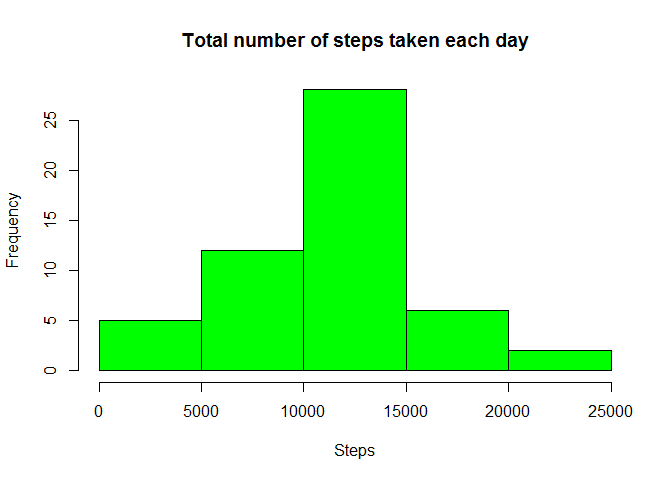
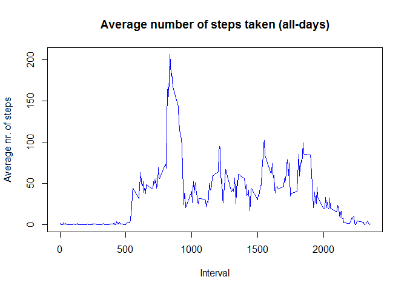
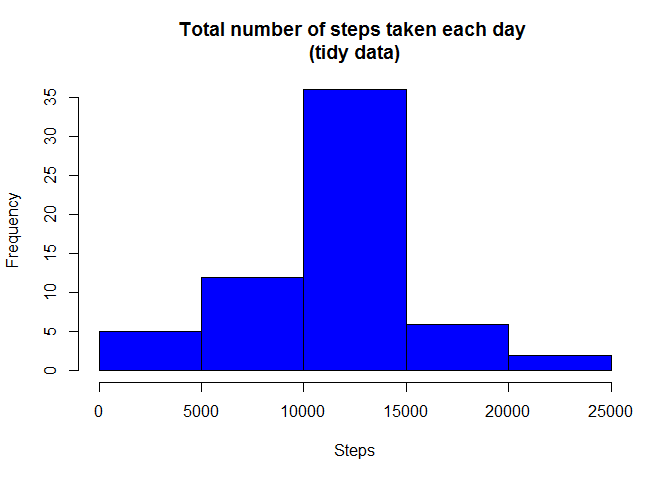
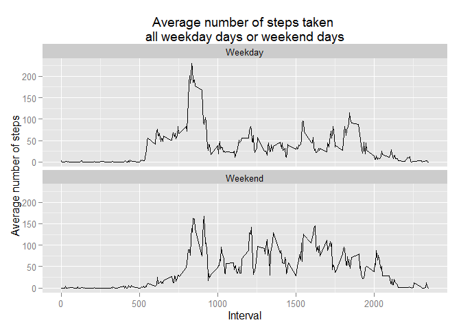

# Reproducible Research: Peer Assessment 1

## Introduction

### Assignment

It is now possible to collect a large amount of data about personal movement using activity monitoring devices such as a [Fitbit](http://www.fitbit.com), [Nike
Fuelband](http://www.nike.com/us/en_us/c/nikeplus-fuelband), or
[Jawbone Up](https://jawbone.com/up). These type of devices are part of the “quantified self” movement – a group of enthusiasts who take measurements about themselves regularly to improve their health, to find patterns in their behavior, or because they are tech geeks. But these data remain under-utilized both because the raw data are hard to obtain and there is a lack of statistical methods and software for processing and interpreting the data.

This assignment makes use of data from a personal activity monitoring device. This device collects data at 5 minute intervals through out the day. The data consists of two months of data from an anonymous individual collected during the months of October and November, 2012 and include the number of steps taken in 5 minute intervals each day.

### Data

The data for this assignment can be downloaded from [Activity monitoring data](https://d396qusza40orc.cloudfront.net/repdata%2Fdata%2Factivity.zip) [52K]

The variables included in this dataset are:

* **steps**: Number of steps taking in a 5-minute interval (missing
    values are coded as `NA`)

* **date**: The date on which the measurement was taken in YYYY-MM-DD
    format

* **interval**: Identifier for the 5-minute interval in which
    measurement was taken

The dataset is stored in a comma-separated-value (CSV) file including a total of 17,568 observations and also available in the [cloned GIT repository](https://github.com/szekendia/RepData_PeerAssessment1), therefore **the R code does not download it again**.

In order to include the R code I used to generate the output during the assignment, the global variable `echo = TRUE` is set:


```r
library(knitr)
opts_chunk$set(echo = TRUE)
```

The following instructions and R code chunks guide you through the reproduction of the data analysis.

## Loading and preprocessing the data

1. Load the data (i.e. `read.csv()`)

The compressed dataset is extracted to the Default Working Directory of R and imported into the `data` dataframe. The `subfolder` and `repofolder` variables in the following code chunk might be localized to reflect on the personal environment of the analyst. Date is coerced to `Date` during the import.


```r
subfolder <- paste(getwd(), "RepData_PA1", sep = "/")
repofolder <- "D:/Minden/Adam/Coursera/GitRepositories/RepData_PeerAssessment1"
zipfile <- paste(repofolder, "activity.zip", sep="/")

if(!file.exists(subfolder)) {dir.create(subfolder)}

filelist <- unzip(zipfile, list=TRUE)
unzip(zipfile, files=filelist$Name, exdir=subfolder)

setClass("myDate")
setAs("character","myDate", function(from) as.Date(from, format="%Y-%m-%d") )
data <- read.csv(file = paste(subfolder, "activity.csv", sep = "/"),
                header = TRUE,
                colClasses = c("numeric", "myDate", "numeric"))
```

The summary of the imported dataset is as follows:


```r
summary(data)
```

```
##      steps             date               interval     
##  Min.   :  0.00   Min.   :2012-10-01   Min.   :   0.0  
##  1st Qu.:  0.00   1st Qu.:2012-10-16   1st Qu.: 588.8  
##  Median :  0.00   Median :2012-10-31   Median :1177.5  
##  Mean   : 37.38   Mean   :2012-10-31   Mean   :1177.5  
##  3rd Qu.: 12.00   3rd Qu.:2012-11-15   3rd Qu.:1766.2  
##  Max.   :806.00   Max.   :2012-11-30   Max.   :2355.0  
##  NA's   :2304
```

2. Process/transform the data (if necessary) into a format suitable for your analysis

At this phase of the assignment the data is not transformed, since NA values might be ignored untill further instructions.


## What is mean total number of steps taken per day?

For this part of the assignment, you can ignore the missing values in the dataset.

1. Make a histogram of the total number of steps taken each day


```r
tmp.sum <- aggregate(steps ~ date, data, FUN = "sum")
hist(tmp.sum$steps, main = "Total number of steps taken each day", xlab = "Steps", ylab = "Frequency", col = "green")
```

 

2. Calculate and report the **mean** and **median** total number of steps taken per day

The summary of the **total number of steps taken per day** is as follows:


```r
summary(tmp.sum)
```

```
##       date                steps      
##  Min.   :2012-10-02   Min.   :   41  
##  1st Qu.:2012-10-16   1st Qu.: 8841  
##  Median :2012-10-29   Median :10765  
##  Mean   :2012-10-30   Mean   :10766  
##  3rd Qu.:2012-11-16   3rd Qu.:13294  
##  Max.   :2012-11-29   Max.   :21194
```

Specifically, the **mean** and **median** of number of **total number of steps taken per day** are:


```r
if("xtable" %in% rownames(installed.packages()) == FALSE) {install.packages("xtable")}
library(xtable)
report <- as.data.frame(mean(tmp.sum$steps))
report$v2 <- median(tmp.sum$steps)
names(report) <- c("Mean(steps)", "Median(steps)")
print(xtable(report), type = "html")
```

<!-- html table generated in R 3.2.2 by xtable 1.7-4 package -->
<!-- Mon Sep 21 01:26:03 2015 -->
<table border=1>
<tr> <th>  </th> <th> Mean(steps) </th> <th> Median(steps) </th>  </tr>
  <tr> <td align="right"> 1 </td> <td align="right"> 10766.19 </td> <td align="right"> 10765.00 </td> </tr>
   </table>


## What is the average daily activity pattern?

1. Make a time series plot (i.e. `type = "l"`) of the 5-minute interval (x-axis) and the average number of steps taken, averaged across all days (y-axis)


```r
tmp.avg <- aggregate(steps ~ interval, data, FUN = "mean")

plot(tmp.avg$interval,
     tmp.avg$steps,
     type="l",
     main = "Average number of steps taken (all-days)",
     xlab = "Interval",
     ylab = "Average nr. of steps",
     col = "blue"
     )
```

 

2. Which 5-minute interval, on average across all the days in the dataset, contains the maximum number of steps?


```r
print(xtable(tmp.avg[which.max(tmp.avg$steps), ]), type = "html")
```

<!-- html table generated in R 3.2.2 by xtable 1.7-4 package -->
<!-- Mon Sep 21 01:26:03 2015 -->
<table border=1>
<tr> <th>  </th> <th> interval </th> <th> steps </th>  </tr>
  <tr> <td align="right"> 104 </td> <td align="right"> 835.00 </td> <td align="right"> 206.17 </td> </tr>
   </table>

## Imputing missing values

Note that there are a number of days/intervals where there are missing values (coded as `NA`). The presence of missing days may introduce bias into some calculations or summaries of the data.

1. Calculate and report the total number of missing values in the dataset (i.e. the total number of rows with `NA`s)


```r
sum(is.na(data$steps))
```

```
## [1] 2304
```

2. Devise a strategy for filling in all of the missing values in the dataset.

The missing values are filled with the average steps of that 5-minute interval where the data is missing from.

3. Create a new dataset that is equal to the original dataset but with the missing data filled in.


```r
## Merge original data with interval averages
data.merge <- merge(data, tmp.avg, by="interval")

## Replace NA data by average steps in the corresponding interval
data.na <- subset(data.merge, is.na(steps.x), select = c("interval", "date", "steps.y"))
names(data.na) <- c("interval", "date", "steps")

## Create subset of original and correct data
data.ok <- subset(data.merge, !is.na(steps.x), select = c("interval", "date", "steps.x"))
names(data.ok) <- c("interval", "date", "steps")

## Append the corrected subset to the original subset
data.tidy <- rbind(data.na, data.ok)
rm(list=c("data.merge","data.na","data.ok"))
```


4. Make a histogram of the total number of steps taken each day and Calculate and report the **mean** and **median** total number of steps taken per day. Do these values differ from the estimates from the first part of the assignment? What is the impact of imputing missing data on the estimates of the total daily number of steps?

The histogram **Total number of steps taken each day** based on the tidy dataset


```r
tmp.sum <- aggregate(steps ~ date, data.tidy, FUN = "sum")
hist(tmp.sum$steps, main = "Total number of steps taken each day \n(tidy data)", xlab = "Steps", ylab = "Frequency", col = "blue")
```

 

The **mean** and **median** of steps based on the tidy dataset


```r
report$imputation <- "Before"
report.tidy <- as.data.frame(mean(tmp.sum$steps))
report.tidy$v2 <- median(tmp.sum$steps)
names(report.tidy) <- c("Mean(steps)", "Median(steps)")
report.tidy$imputation <- "After"

report.compare <- rbind(report, report.tidy)
print(xtable(report.compare), type = "html")
```

<!-- html table generated in R 3.2.2 by xtable 1.7-4 package -->
<!-- Mon Sep 21 01:26:04 2015 -->
<table border=1>
<tr> <th>  </th> <th> Mean(steps) </th> <th> Median(steps) </th> <th> imputation </th>  </tr>
  <tr> <td align="right"> 1 </td> <td align="right"> 10766.19 </td> <td align="right"> 10765.00 </td> <td> Before </td> </tr>
  <tr> <td align="right"> 2 </td> <td align="right"> 10766.19 </td> <td align="right"> 10766.19 </td> <td> After </td> </tr>
   </table>


The **median** values differ from the estimates taken before the imputation. The **mean** of steps before and after the imputation **remained the same**; while, the **median** after the imputation is **slightly higher* than before

## Are there differences in activity patterns between weekdays and weekends?

For this part the `weekdays()` function may be of some help here. Use the dataset with the filled-in missing values for this part.

1. Create a new factor variable in the dataset with two levels -- "weekday" and "weekend" indicating whether a given date is a weekday or weekend day.


```r
if("dplyr" %in% rownames(installed.packages()) == FALSE) {install.packages("dplyr")}
library(dplyr)
```

```
## 
## Attaching package: 'dplyr'
## 
## The following objects are masked from 'package:stats':
## 
##     filter, lag
## 
## The following objects are masked from 'package:base':
## 
##     intersect, setdiff, setequal, union
```

```r
## The wday component of a POSIXlt object is the numeric weekday (0-6 starting on Sunday)
data.tidy <- mutate(data.tidy, wd.we = as.POSIXlt(date)$wday)
data.tidy <- mutate(data.tidy, wd.we.string = ifelse((as.POSIXlt(date)$wday == 6 | as.POSIXlt(date)$wday == 0),"Weekend", "Weekday"))
```

1. Make a panel plot containing a time series plot (i.e. `type = "l"`) of the 5-minute interval (x-axis) and the average number of steps taken, averaged across all weekday days or weekend days (y-axis).


```r
if("ggplot2" %in% rownames(installed.packages()) == FALSE) {install.packages("ggplot2")}
library(ggplot2)
tmp.avg.wd.we <- aggregate(steps ~ interval + wd.we.string, data.tidy, FUN = "mean")

qplot(interval, steps, data=tmp.avg.wd.we, geom=c("line"), xlab="Interval", 
      ylab="Average number of steps", main="Average number of steps taken \nall weekday days or weekend days") + facet_wrap(~ wd.we.string, ncol=1)
```

 
